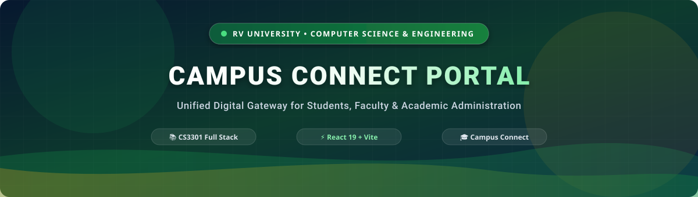
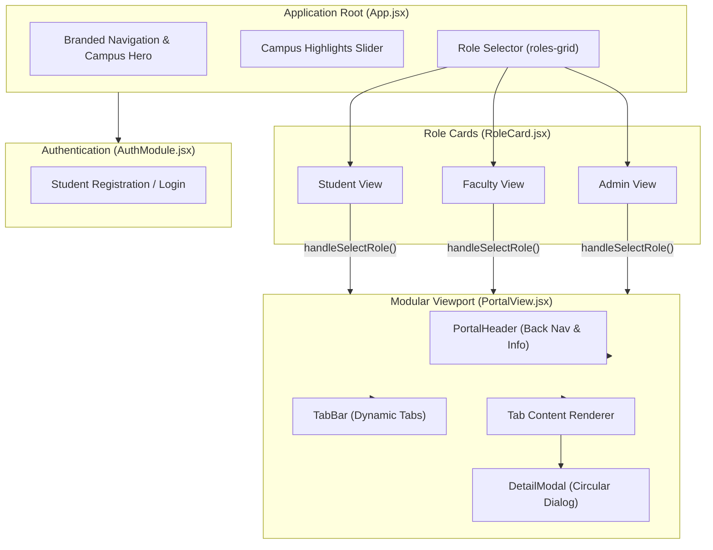

# Campus Connect Portal 🎓

> **A Next-Generation Campus Management & Modular Academic Hub**  
> Designed for **RV University — School of Computer Science & Engineering**  
> *Course: CS3301 Full Stack Development (Semester V)*

---



<div align="center">

[](https://react.dev)
[](https://vitejs.dev)
[](https://react.dev/learn/your-first-component)
[](https://react.dev/reference/react/useState)
[](https://vitejs.dev/guide/build.html)

[Overview](#-overview) •
[Architecture](#-system-architecture) •
[Role Portals](#-role-portals--capabilities) •
[Component Matrix](#-component-specifications) •
[Setup & Usage](#-getting-started) •
[Project Structure](#-repository-layout)

</div>

---

## 📌 Overview

**Campus Connect Portal** is a unified digital ecosystem connecting students, faculty members, and administrative staff across campus. Built using a reactive component-based architecture, the platform streamlines circular distribution, academic assignment tracking, interactive attendance monitoring, and profile management into an intuitive web interface.

### Key Capabilities

* **Decoupled Component Hierarchy**: Pure presentational views receive configuration via props, while parent containers handle reactive state transitions.
* **Role-Specific Dashboards**: On-demand dashboard rendering for **Student**, **Faculty**, and **Admin** workflows.
* **Event-Driven Interactions**: Dynamic tab navigation, interactive circular detail popups (`DetailModal`), submission toggling, and live attendance incrementation.
* **Full-Spectrum Responsiveness**: Styled with flexible CSS grid and flex layouts, custom gradients, and fluid typography.

---

## 🏛️ System Architecture

The client application separates stateful containers from reusable presentation components:



---

## 👥 Role Portals & Capabilities

| Portal View | Key Workflows | Interactive Elements |
| :--- | :--- | :--- |
| **Student** | • Real-time circular notices<br/>• Assignment submission tracking<br/>• Attendance calculation & logging<br/>• Academic profile overview | • `[View Details]` modal dialogs<br/>• Pending ⟷ Submitted status toggles<br/>• Interactive `+ Check In` session counter<br/>• Real-time progress bar animations |
| **Faculty** | • Department notice broadcasting<br/>• Course assignment distribution<br/>• Class attendance management | • Notice creation controls<br/>• Submission status indicators |
| **Administrator** | • Registry management<br/>• System-wide notice control<br/>• Institutional audit logs | • User administration tools<br/>• System metric panels |

---

## 🧩 Component Specifications

The frontend implements React best practices, adhering to clean prop contracts and unidirectional data flow:

| Component | Category | Inbound Props | Internal State | Description |
| :--- | :--- | :--- | :--- | :--- |
| `RoleCard.jsx` | Presentation | `title`, `icon`, `features`, `borderClass`, `bgBtnClass`, `btnText`, `onSelect`, `isActive` | None | Displays selectable user tier card with capability bullets and action button. |
| `PortalHeader.jsx` | Navigation | `title`, `icon`, `subtitle`, `onBack` | None | Header bar containing section branding and a smooth exit action back to campus view. |
| `TabBar.jsx` | Navigation | `tabs`, `activeTab`, `onTabChange` | None | Renders interactive pills and dispatches tab switch events upstream. |
| `ItemCard.jsx` | Presentation | `title`, `meta`, `badge`, `badgeType`, `actionText`, `onAction`, `children` | None | Standardized container for notice items, assignment records, and metrics. |
| `DetailModal.jsx` | Feedback | `isOpen`, `item`, `onClose` | None | Accessible overlay popup showing complete circular details with dismiss triggers. |
| `PortalView.jsx` | Container | `role`, `onBack` | `activeTab`, `selectedItem`, `assignments`, `attendance`, `profileStatus` | Central state coordinator rendering appropriate panels and handling user mutations. |
| `AuthModule.jsx` | Form / Auth | `initialMode` | `mode`, form state fields | Toggleable authentication interface for student registration and login. |

---

## 💻 Tech Stack

* **Frontend Framework**: React 19 (Hooks, JSX, Virtual DOM)
* **Tooling & Build System**: Vite 8 (Hot Module Replacement, ESBuild)
* **Styling**: Vanilla CSS3 (Custom Properties, Flexbox, CSS Grid, Fluid Typography)
* **Icons & Vector Assets**: Custom SVG Components & WebP Visuals
* **Runtime**: Node.js (v18+)

---

## 📁 Repository Layout

```
campus-connect-portal/
├── assets/                          # SVG illustrations and banner resources
│   ├── banner.svg                   # Vector header banner
│   └── footer.svg                   # Flowing wave SVG divider
├── client/                          # React client application
│   ├── index.html                   # HTML entry point with React root mount
│   ├── vite.config.js               # Vite project configuration
│   ├── package.json                 # Client dependencies and npm scripts
│   └── src/
│       ├── main.jsx                 # Application DOM bootstrap
│       ├── App.jsx                  # Top-level state coordinator & role switcher
│       ├── carousel.js              # Campus highlights slider logic
│       ├── style.css                # Base stylesheet and university design tokens
│       ├── portal.css               # Portal-specific layout, card & modal rules
│       ├── index.css                # Global typography and reset definitions
│       ├── assets/                  # Campus images and icons
│       └── components/
│           ├── AuthModule.jsx       # Student authentication view
│           ├── DetailModal.jsx      # Modal popup for circulars
│           ├── ItemCard.jsx         # Card rows for notices & assignments
│           ├── PortalHeader.jsx     # Slate portal banner & back trigger
│           ├── PortalView.jsx       # Role container with tab state & metrics
│           ├── RoleCard.jsx         # Modular role cards
│           └── TabBar.jsx           # Reusable tab button navigation
├── server/                          # Backend API services
│   ├── package.json                 # Server dependencies
│   └── src/
│       ├── app.js                   # Express application entry
│       ├── config/                  # Database connections
│       ├── controllers/             # Request handlers
│       ├── middleware/              # Auth & validation middlewares
│       └── models/                  # Data models
├── EXPERIMENT_5.md                  # Lab report documentation (Experiment 5)
├── package.json                     # Root configuration
└── README.md                        # Project documentation
```

---

## 🚀 Getting Started

### Prerequisites
* [Node.js](https://nodejs.org/) (version 18 or higher recommended)
* `npm` (bundled with Node.js)

### 1. Installation

Install dependencies for the client application:

```bash
cd client
npm install
```

*(Optional)* Install dependencies for backend services:

```bash
cd ../server
npm install
```

### 2. Running the Development Server

Start the Vite development server:

```bash
cd client
npm run dev
```

The application will be available at:
```
http://localhost:5173
```

### 3. Production Build

To compile and bundle the frontend for production deployment:

```bash
cd client
npm run build
```

The production assets will be output to `client/dist/`.

---

## 🧪 Laboratory Documentation

Comprehensive documentation for **Experiment 5: Building Modular Frontend Applications Using a Component-Based Approach (React)** is located in [`EXPERIMENT_5.md`](./EXPERIMENT_5.md). It outlines:
* Theoretical fundamentals of component composition, props, and `useState`.
* Step-by-step algorithms and implementation breakdown.
* Component interaction models and state mutations.
* Verification checklists and test case outputs.

---

<div align="center">


<sub>School of Computer Science & Engineering • RV University • Academic Session 2026–2027</sub>

</div>
